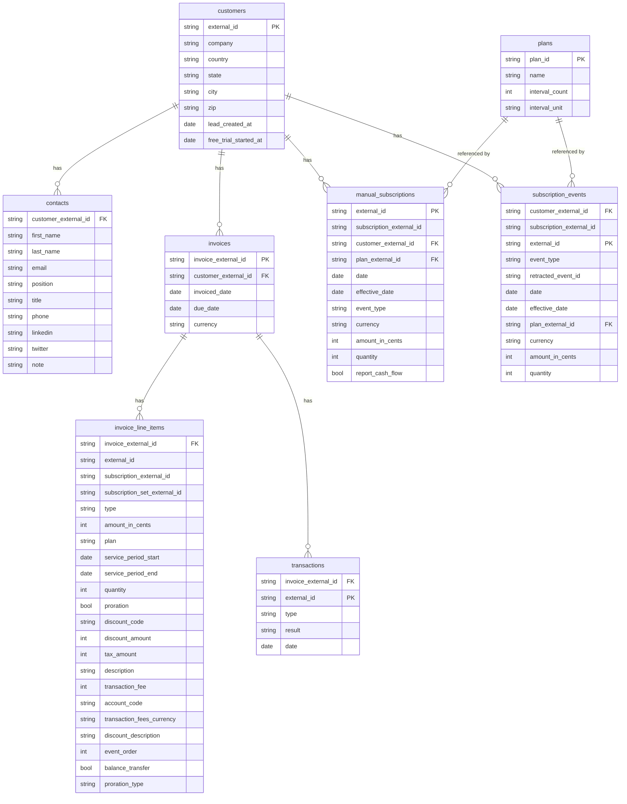

# dbt SaaS Analytics

This repository contains a small dbt project used to model sample SaaS billing data. Seed CSV files located under the `seeds/` directory create source tables such as `customers`, `invoices` and `invoice_line_items`. An entity relationship diagram for these seeds is shown below for convenience.

### Seed Entity Relationship Diagram



The core models live in the `models/` folder:

- `models/staging/` – staging models built directly from the seed tables.
- `models/marts/dim/` – dimension tables.
- `models/marts/fct/` – fact tables.

The project relies on the [`dbt_constraints`](https://github.com/Snowflake-Labs/dbt_constraints) package for database constraints and uses [`uv`](https://github.com/astral-sh/uv) as the Python package manager.

## Development setup

1. **Install dependencies**

   ```bash
   uv pip install -e .
   ```

   The command above reads `pyproject.toml` and installs dbt and other tools into a virtual environment under `.venv`.

2. **Activate the virtual environment**

   ```bash
   source .venv/bin/activate
   ```

3. **Database connection**

   By default the project uses a local PostgreSQL instance as configured in `profiles.yml`.
   The `.devcontainer/` folder contains everything needed to run this project in
   VS Code or any editor that supports dev containers. Opening the repository in
   a dev container automatically starts a PostgreSQL service alongside Python so
   you can run dbt commands without additional setup.

## Running dbt

All dbt commands should be executed through `uv run`:

```bash
uv run dbt parse       # parse project
uv run dbt build       # run and test models
```

SQL models and YAML files can be formatted with:

```bash
uv run sqlfmt models/
```

## Guidelines for building models

- Place new staging models in `models/staging/` and use seed sources declared in `models/sources/_models.yml`.
- Dimensions and facts belong under `models/marts/` (`dim/` and `fct/` subfolders).
- Document columns and add tests in the corresponding YAML files.
- Keep SQL style consistent by running `uv run sqlfmt models/` before committing.
- Ensure models run successfully with `uv run dbt build` and update any documentation when changes are made.
