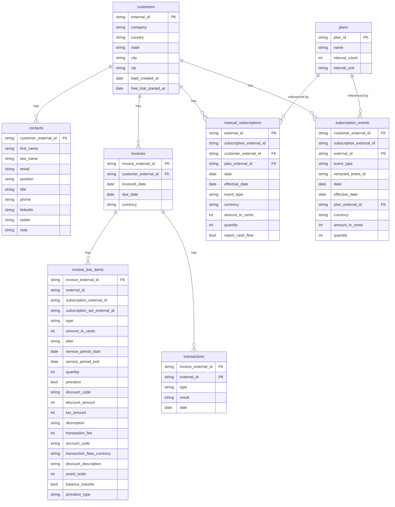

# Entity Relationship Diagram for Seed Tables

```mermaid
erDiagram
    customers {
        string external_id PK
        string company
        string country
        string state
        string city
        string zip
        date lead_created_at
        date free_trial_started_at
    }
    contacts {
        string customer_external_id FK
        string first_name
        string last_name
        string email
        string position
        string title
        string phone
        string linkedin
        string twitter
        string note
    }
    invoices {
        string invoice_external_id PK
        string customer_external_id FK
        date invoiced_date
        date due_date
        string currency
    }
    invoice_line_items {
        string invoice_external_id FK
        string external_id
        string subscription_external_id
        string subscription_set_external_id
        string type
        int amount_in_cents
        string plan
        date service_period_start
        date service_period_end
        int quantity
        bool proration
        string discount_code
        int discount_amount
        int tax_amount
        string description
        int transaction_fee
        string account_code
        string transaction_fees_currency
        string discount_description
        int event_order
        bool balance_transfer
        string proration_type
    }
    transactions {
        string invoice_external_id FK
        string external_id PK
        string type
        string result
        date date
    }
    manual_subscriptions {
        string external_id PK
        string subscription_external_id
        string customer_external_id FK
        string plan_external_id FK
        date date
        date effective_date
        string event_type
        string currency
        int amount_in_cents
        int quantity
        bool report_cash_flow
    }
    subscription_events {
        string customer_external_id FK
        string subscription_external_id
        string external_id PK
        string event_type
        string retracted_event_id
        date date
        date effective_date
        string plan_external_id FK
        string currency
        int amount_in_cents
        int quantity
    }
    plans {
        string plan_id PK
        string name
        int interval_count
        string interval_unit
    }

    customers ||--o{ contacts: "has"
    customers ||--o{ invoices: "has"
    customers ||--o{ manual_subscriptions: "has"
    customers ||--o{ subscription_events: "has"
    invoices ||--o{ invoice_line_items: "has"
    invoices ||--o{ transactions: "has"
    plans ||--o{ manual_subscriptions: "referenced by"
    plans ||--o{ subscription_events: "referenced by"
```
